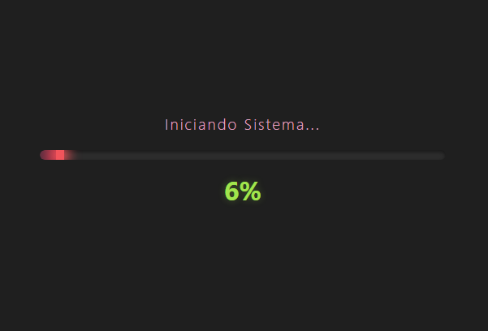
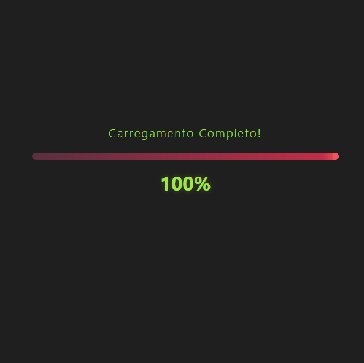

# ⏳ Minimalist Dynamic Loading System

  <table border="0">
    <tr>
      <td valign="center" width="50%">
        
      </td>
      <td valign="center" width="50%">
        
      </td>
    </tr>
  </table>
   

  
    
  
<em>Clique em "Acessar Projeto" acima para ver a animação e o comportamento da interface em tempo real.</em>

---

## 🚀 Sobre o Projeto
Este projeto simula um sistema de carregamento dinâmico desenvolvido para demonstrar como pequenos detalhes de interface podem impactar drasticamente a experiência do usuário (UX). O foco foi criar uma interação fluida e moderna, utilizando tecnologias fundamentais do Front-end de forma avançada.

## 🛠️ Tecnologias e Conceitos
* **HTML5 Semântico:** Estrutura limpa, focada em acessibilidade e SEO.
* **CSS3 Moderno:** Gerenciamento de cores via variáveis globais (`:root`) e layouts responsivos.
* **Vanilla JavaScript:** Lógica de manipulação de estado e controle de tempo sem dependências externas.

## 🧠 Diferenciais Técnicos

### 1. Animação Orgânica com Cubic-Bézier
Para evitar o movimento linear e robótico comum em barras de progresso, utilizei a função de tempo `cubic-bezier(0.17, 0.67, 0.83, 0.67)`. Essa curva de aceleração customizada confere um movimento natural, simulando inércia e fluidez.

### 2. Simulação de Processamento Real
A lógica de progressão não é constante; ela utiliza incrementos randômicos controlados por `setInterval`. Isso replica o comportamento de sistemas reais, onde diferentes módulos têm tempos de processamento variados, tornando a simulação mais autêntica.

### 3. Gerenciamento de Estado e UI Reativa
O script atua como um "observador" do progresso, disparando gatilhos visuais em thresholds específicos (40%, 80% e 100%). Isso permite que a interface reaja ao estado atual, alterando mensagens de status e paletas de destaque dinamicamente.

## 🎨 Design System
O projeto utiliza uma paleta de cores personalizada, pensada para o máximo contraste em ambientes Dark Mode:
* **Fundo (Background):** `#1F1F1F`
* **Cor Principal (Barra):** `#5A2F3F`
* **Sucesso e Finalização:** `#A1E44D` (Verde vibrante para feedback positivo)
* **Detalhes de Destaque:** `#F2545B` e `#C72C48`

---

Desenvolvido como parte do meu portfólio de estudos em Engenharia de Front-End.
